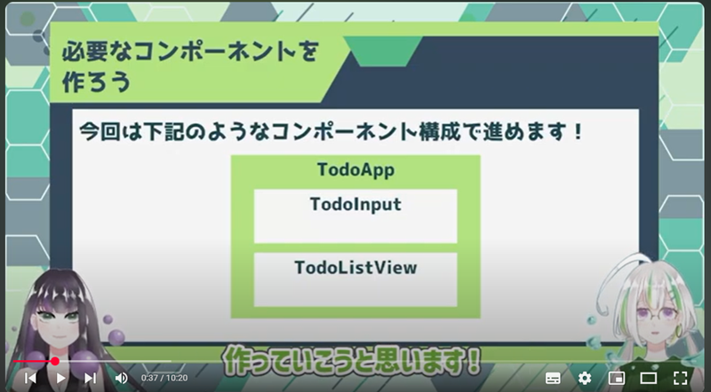

# Vue.js入門 -ToDoリスト開発- Lesson9～

～目次～

- <a href="#L9">Lesson9</a>
- <a href="#L10">Lesson10</a>
- <a href="#L11">Lesson11</a>
- <a href="#L12">Lesson12</a>
---

<a name="#L9"></a>
<br><br>

# 【Vue.js入門#9】Vue.jsでWebアプリケーションを作ろう！/Todoタスクを入力→保存【Vue3】

https://www.youtube.com/watch?v=TtygTiwjv6k&list=PL33OZZ24O4xDJ-_mqltklx8-9DK79iDOj&index=10


## コンポーネント構築




●　この時点では、`./components`配下にはコンポーネントを複数作成する。
大元の`App.vue`は、`./componentsTodoApp.vue`のみを取り込ませる。


```sh
app/lesson-todo-list/src
├── App.vue
├── assets
│   └── logo.png
├── components
│   ├── TodoApp.vue        //ゼロから作成
│   ├── TodoInput.vue      //ゼロから作成
│   └── TodoListView.vue   //ゼロから作成
├── const                  //フォルダとファイルを新規作成（共通ファイル）
│   └── common.js
└── main.js

```

## localStorageの扱い

●　データ形式

- データ形式は`key-value方式`のため、`valueは文字列である必要がある。`
- JSONオブジェクトから、文字列変換するには`SON.stringify(JSONオブジェクト)`を使う。
- 逆に文字列から、JSONオブジェクトにするには`JSON.parse(文字列)`にする。


●　データの出し入れ

- データの取得：`localStorage.getItem('key名')`
- データの保存：`localStorage.setItem('key名',文字列)`
- オブジェクト配列の追加: `オブジェクト名.push(追加したいオブジェクト)`

●　Todoデータの構造体

- オブジェクトとして、あらかじめ`const`で定義する。 

```javascript
const newItem = {
    id: items.length,
    content: input.value,
    limit: inputDate.value,
    state: statuses.NOT_START,
    onEdit: false,
};
```


--------------------
--------------------
--------------------


<a name="#L9"></a>
<br><br>

# 【Vue.js入門#10】Vue.jsでWebアプリケーションを作ろう！/タスクを表示しよう＆バリデーション【Vue3】

https://www.youtube.com/watch?v=LeJvlBljHc0&list=PL33OZZ24O4xDJ-_mqltklx8-9DK79iDOj&index=11


## タスクを画面に表示

localStorageからタスクのリストを取得して、画面に一覧表示させる。

タスク表示欄は`TodoListView.vue`にて実装する。


●　ソース実装例

```html
<template>
    <div>
        <table>
            <tr>
                <th class="th-id">ID</th>
                <th class="th-value">やること</th>
                <th class="th-limit">期限</th>
                <th class="th-state">状態</th>
                <th class="th-edit">編集</th>
                <th class="th-delete">削除</th>            
            </tr>
            <tr v-for="item in items" :key="item.id">
                <td>{{ key }}</td>
                <td>{{ item.content }}</td>
                <td>{{ item.limit }}</td>
                <td>{{ item.state.value }}</td>
                <td>{{ item.onEdit }}</td>
                <td><button>編集</button></td>
                <td><button>削除</button></td>            
            </tr>
        </table>
    </div>
</template>

<script setup>
    const items = JSON.parse(localStorage.getItem("items")) || [];
</script>
```


## バリデーション実装

`onSubmitForm()`のメソッドの最初にチェックを入れ、無記入項目があればエラーメッセージを出力する。


●　これまでの進行でなかなか気づかない点

フォームの`submit`は、当然ながら画面がリロードされてしまうので、データの保存やバリデーションの制御やデバッグができなくなってしまう。

リロードしないようにするためには、`event.preventDefault();`を入れる。


--------------------
--------------------
--------------------


<a name="#L11"></a>
<br><br>

# 【Vue.js入門#11】Vue.jsでWebアプリケーションを作ろう！/タスクの編集機能を作る【Vue3】


## 編集機能の実装

●　実装の主軸

- ① 編集ボタンを押すと編集モードになる。
- ② 新しく入力した内容でタスクを上書き保存させる。

---

### ① 編集ボタンを押すと編集モードになる。

#### ①- : `TodoListView`にて、JSONを読み込ませる

```javascript
// before
const items = JSON.parse(localStorage.getItem("items")) || [];

// after
import { ref } from 'vue';
const items = ref(JSON.parse(localStorage.getItem("items")) || []);
```


#### ①-2 : `td`要素の中を変更する

```html
<!-- before -->
<td>{{ item.content }}</td>
<td>{{ item.limit }}</td>

<!-- after -->
<td>
    <span v-if="!item.onEdit" >{{ item.content }}</span>
    <input v-else type="text">
</td>
<td>
    <span v-if="!item.onEdit">{{ item.limit }}</span>
    <input v-else type="date">
</td>
```


#### ①-3 : ステータス欄を選択入力可能にする

```html
<!-- before -->
<td>{{ item.state.value }}</td>

<!-- after -->
<td>
    <span v-if="!item.onEdit" >{{ item.state.value }}</span>
    <select v-else v-model="inputState">
        <option
            v-for="state in statuses"
            :key="state.id"
            :value="state"  <!-- オブジェクト丸ごとでないと編集モードの時にプルダウン初期値が設定されなくなる。idとvalueがそのまま渡される  -->
            :selected="state.id == item.state.id">
            {{ state.value }}
        </option>
    </select>    
</td>
```


#### ①-4 : 「編集」ボタンの機能実装

```html
<!-- before -->
<td><button>編集</button></td>

<!-- after -->
<td>
    <button @click="onEdit(item.id)">編集</button>
</td>
```

さらに、onEditメソッドを実装する。

```javascript
    function onEdit(id){
        items.value[id].onEdit = true;
    }
```

#### ①-5 : 「編集」ボタンクリックの瞬間に、入力欄の初期値を設定

このままでは、「編集」ボタンクリックを行うと、入力欄がブランクになってしまうため、初期値設定を行う。

`ref(JSON.parse)`の直後に、各種入力値の変数を構築する。

```javascript
const inputContent = ref('');
const inputLimit = ref('');
const inputStatus = ref('');
```

テンプレートの各種入力欄に`v-model`で設定追加する。

```html
<input v-else v-model="inputContent" type="text">
<input v-else v-model="inputLimit" type="date">
<select v-else v-model="inputStatus">

```

`onEdit`メソッドで、JSONデータを各種変数に設定する。

すでに`ref()`宣言した変数なので、valueで値を設定する。

```javascript
    function onEdit(id){
        inputContent.value = items.value[id].content;
        inputLimit.value = items.value[id].limit;
        inputStatus.value = items.value[id].state;
        items.value[id].onEdit = true;
    }
```

---


### ② 新しく入力した内容でタスクを上書き保存させる。

localStorageは、下記の3点に機能が限られる。更新というものがない。


- データの取得：`localStorage.getItem('key名')`
- データの保存：`localStorage.setItem('key名',文字列)`
- データの保存：`localStorage.delete('key名')`


ピンポイントで更新は出来ず、全体のデータを用意して同じキーで丸ごと上書き保存する方法となってしまう。


### ②-1 完了ボタンの追加と、更新メソッドの追加

入力欄を作ったのと同じ要領で、「完了」ボタンを作り、クリック時に`onUpdate()`メソッドを実行するようにする。

```html
<!-- before -->
<button @click="onEdit(item.id)">編集</button>

<!-- after -->
<button v-if="!item.onEdit" @click="onEdit(item.id)">編集</button>
<button v-else @click="onUpdate(item.id)">完了</button>
```


```javascript
    function onUpdate(id){
        const newItem = {
            id: id,
            content: inputContent.value,
            limit: inputLimit.value,
            state: inputStatus.value,
            onEdit: false,
        };

        //↓ 用例：array.splice(start, deleteCount, item1, item2, ...);
        items.value.splice(id, 1, newItem);
        
        //更新後のitemsを配列全体ごと置き換える
        localStorage.setItem("items",  JSON.stringify(items.value));
    }
```


●　(Copilot抜粋)

```
JavaScriptのspliceメソッドは、配列の要素を追加、削除、または置き換えるために使用されます。

以下はその基本的な使い方です：
要素の削除: array.splice(start, deleteCount)を使用して、指定した位置から指定した数の要素を削除します。
要素の追加: array.splice(start, 0, item1, item2, ...)を使用して、指定した位置に新しい要素を追加します。
要素の置き換え: array.splice(start, deleteCount, item1, item2, ...)を使用して、指定した位置から要素を削除し、新しい要素で置き換えます。 

このメソッドは元の配列を直接変更するため、注意が必要です。
```

### ②-1 完了ボタンクリック時のバリデーション追加


テンプレート冒頭に、エラーメッセージを出す`<p>`を追加。

```html
<template>
    <p v-if="isErrorMsg">タスク・期限を両方入力してください</p>
```


`onUpdate()`メソッドに下記のコードを追加。

```javascript
       //メソッド冒頭部
       if(inputContent.value=='' || inputLimit.value==''){
            isErrorMsg.value = true;
            return false;
        }

        //メソッド最後尾に、isErrorMsgフラグを戻す
        isErrorMsg.value = false;
```


--------------------
--------------------
--------------------


<a name="#L12"></a>
<br><br>


# 【Vue.js入門#12】Vue.jsでWebアプリケーションを作ろう！/タスクの削除機能を作る【Vue3】

https://www.youtube.com/watch?v=vHQ5bUAVjZQ&list=PL33OZZ24O4xDJ-_mqltklx8-9DK79iDOj&index=13


## 削除機能の実装


### ① 確認モーダルを出す


### ①-1 確認モーダルの実装

●　テンプレート側

```html
    <div v-if="isShowModal" class="modal">
        <div class="modal-content"> 
        <p>削除してもよいですか？</p>
            <button>はい</button> &nbsp; &nbsp;
            <button>キャンセル</button> 
        </div>
    </div>
```

●　script - setupロジック内の実装

```javascript
    let isShowModal = ref(false);
```


### ①-2 削除ボタンと機能の実装


●　テンプレート側

```html
    <!-- before -->
    <td><button>削除</button></td>        

    <!-- after -->
    <td><button @click="showDeleteModal">削除</button></td>        

```

●　script - setupロジック内の実装 (``)

```javascript
    function showDeleteModal(){
        isShowModal.value = true;
    }
```

### ①-3 モーダルの実装


●　`App.view`で、モーダル専用CSSを実装

```css
.modal {
  position: fixed;
  top:0;
  left:0;
  width: 100%;
  height:100%;
  background: rgba(0, 0, 0, 0.5);
  display: flex; /** */
  justify-content: center; /** */
  align-items: center; /** */
}

.modal-content{
  background: #fff;
  padding: 20px;
  border-radius: 8px;
}
```

---
● (blog抜粋) CSSのpositionを総まとめ！absoluteやfixedの使い方は？

https://saruwakakun.com/html-css/basic/relative-absolute-fixed

```
positionの値
 - static：初期値はこれ。指定することはほとんどない
 - relative：現在の位置を基準に相対的な位置を決める
 - absolute：親要素を基準に絶対的な位置を決める
 - fixed：画面のきまった位置に固定する
```


● (blog抜粋)【初心者向け】フレックスボックスとは？display:flexの使い方（基礎編）

https://blog.asobou.co.jp/web/flex-box


```
フレックスボックスはレイアウトを適用させたい子要素の「要素」と、それらをラップする親要素の「コンテナ」から構成されます。

要素をラップしているコンテナに対し、 display: flex; とCSSを一行追加するだけで直下の子要素を横並びにすることが出来ます。
```

●　（Copilot抜粋）justify-content

```
"justify-content: center;" は、CSSのフレックスボックスにおいて、フレックスコンテナ内のフレックスアイテムを中央に揃えるためのプロパティです。
このプロパティを使用することで、アイテムが主軸方向に中央に配置されます。

具体的には、以下のように使います：
フレックスコンテナに対して display: flex; を指定し、その後に justify-content: center; を追加します。 
これにより、フレックスアイテムはコンテナの中央に均等に配置されます。 
このプロパティは、特にレイアウトを整える際に非常に便利です。
```


●　（Copilot抜粋）align-items

```
CSSの**align-items: center;**プロパティは、フレックスコンテナ内のアイテムを縦方向に中央揃えするために使用されます。具体的には、以下のように機能します：
フレックスコンテナ内のすべての直接の子要素に対して、交差軸方向（縦方向）での配置を制御します。 

値としては、flex-start（上揃え）、flex-end（下揃え）、center（中央揃え）などが指定可能です。 

例えば、align-items: center;を指定すると、フレックスアイテムが中央に配置されます。 

このプロパティは、display: flex;またはdisplay: inline-flex;と一緒に使用される必要があります

```


●　モーダルのロジック実装


→　`TodoListView.vue`

```html
    <div v-if="isShowModal" class="modal">
        <div class="modal-content"> 
        <p>タスク:{{ deleteItemContent }} を削除してもよいですか？</p>
            <button @click="onDeleteItem">はい</button> &nbsp; &nbsp;
            <button @click="onHideModal">キャンセル</button> 
        </div>
    </div>
```


```javascript
    let deleteItemId = '';
    let deleteItemContent = ref();

    function showDeleteModal(id){
        isShowModal.value = true;
        deleteItemId = id;
        deleteItemContent = items.value[id].content;
    }

    function onDeleteItem(){
        isShowModal.value=false;
    }

    function onHideModal(){
        isShowModal.value=false;
    }
```

●　削除ロジック実装

```javascript
    function onDeleteItem(){
        //配列要素削除
        items.value.splice(deleteItemId, 1);

        //IDを全面的に振りなおす
        items.value = items.value.map((item, index)=>({
            id: index,
            content: item.content,
            limit: item.limit,
            state: item.state,
            onEdit: item.onEdit,
        }));

        localStorage.setItem("items",  JSON.stringify(items.value));

        isShowModal.value=false;
    }
```


--------------------
--------------------
--------------------


<a name="#L13"></a>
<br><br>


# 【Vue.js入門#13】Vue.jsでWebアプリケーションを作ろう！/TODOアプリ完成！【Vue3】

https://www.youtube.com/watch?v=da_0LpH7NZI&list=PL33OZZ24O4xDJ-_mqltklx8-9DK79iDOj&index=14

## 講座内で発見された不具合の修正

タスクを複数同時に編集モードにすると、入力可能状態のままになってしまう。

一度に複数のタスクを編集モードにできないようにする。

→　そのためには、`onEdit()`処理中に、編集中のタスクがないかを配列から調べ上げる処理が必要になる。

```html
    <p v-if="isErrorMsg">{{ errMsg }}</p>
```


```javascript

    let isOnEditOther = false;
    let errMsg = ref();

    function onEdit(id){
        items.value.map((item)=>{
            if (item.onEdit){
                isOnEditOther = true;
                return;
            }
        });

        if(isOnEditOther){
            errMsg = 'ほかに編集中のタスクがあります';
            isErrorMsg.value = true;
            return false;
        }

        inputContent.value = items.value[id].content;
        inputLimit.value = items.value[id].limit;
        inputStatus.value = items.value[id].state;
        items.value[id].onEdit = true;
    }
```


## 補完的な機能の実装

### ① 期限切れのタスクは赤色にする (classの状態を変更する)

●　v-bindによる設定

```javascript

/* コロンを使うことでv-bindの略記になる */
:class = "{class名 : 条件}"

```

● `TodoListVuew.vue`

```html
    <tr v-for="item in items" :key="item.id" :class="{red: new Date(item.limit) < today}">
```


```javascript
    const today = new Date();
```

● `App.vue`
```css 
.red {
    color: #FF0000;
}
```


### ② タスクのソート（ターゲット：日付）

● `TodoListVuew.vue`

```html

<!-- before -->
    <th class="th-limit">期限</th>

<!-- after -->
    <th class="th-limit">期限&nbsp;<button @click="sortByLimit()">↓</button></th>

```

```javascript

    function sortByLimit(){
        items.value.sort((a , b) => new Date(a.limit) - new Date(b.limit));
        localStorage.setItem("items", JSON.stringify(items.value));
    }

```


### ③ タスクのソート（ターゲット：ID）

● `TodoListVuew.vue`

```html

<!-- before -->
    <<th class="th-id">ID</th>

<!-- after -->
    <th class="th-id">ID&nbsp;<button @click="sortById()">↓</button></th>

```

```javascript

    function sortById(){
        items.value.sort((a , b) => a.id - b.limit);
        localStorage.setItem("items", JSON.stringify(items.value));
    }

```


### ④ CCSで仕上げ

`TodoApp.vue`

```css

<style scoped>
.todoApp > * {
  margin: 2rem 0 0 0;
}
</style>


```


`TodoInput.vue`

```css
<style scoped>
input {
  width: 70%;
}
label {
  display: flex;
  justify-content: space-between;
}
.submit {
  width: 100%;
}
</style>

```

`TodoListView.vue`

```css
<style scoped>
.modal {
  position: fixed;
  top: 0;
  left: 0;
  width: 100%;
  height: 100%;
  background: rgba(0, 0, 0, 0.5);
  display: flex;
  justify-content: center;
  align-items: center;
}

.modal-content {
  background: #fff;
  padding: 20px;
  border-radius: 8px;
}

.red {
  color: red;
}
table > * > th {
  width: 16.666%;
}
table {
  width: 100%;
}
.btn {
  width: 100%;
}
button {
  border: none;
  border-radius: 5px;
}
.title {
  background-color: rgb(158, 212, 158);
}
</style>

```

### 動画配信主のホームページ

https://marine-sphere.com/articles/vue/vue-complete


