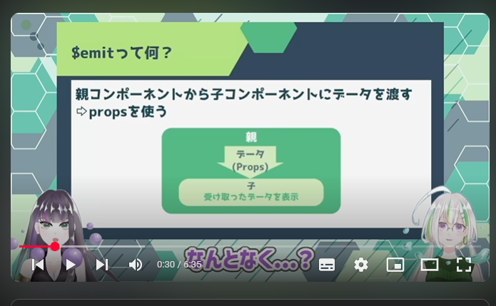
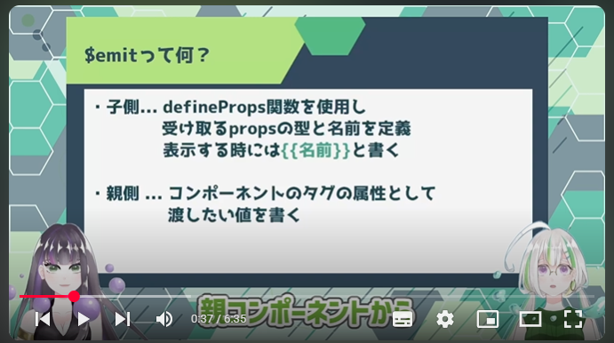
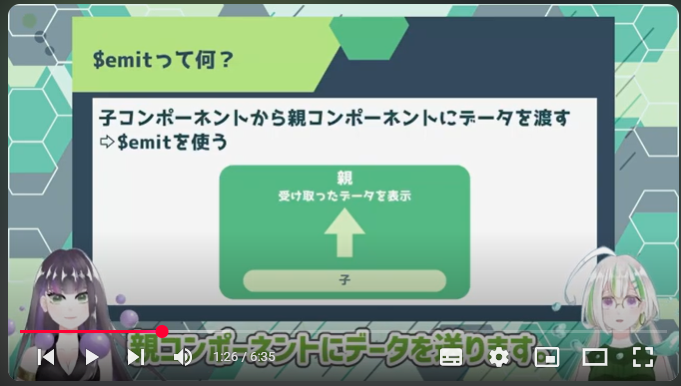
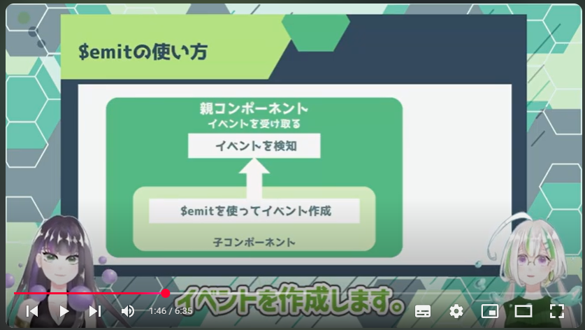
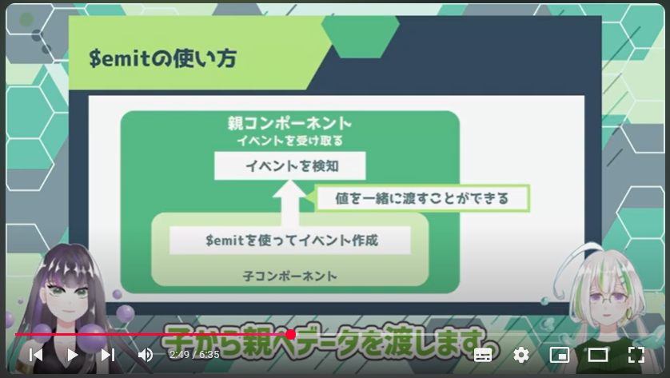

# 個人メモ・テックノート
# Vue.js入門 Lesson1～3

～目次～

- <a href="#L1">Lesson1</a>
- <a href="#L2">Lesson2</a>
- <a href="#L3">Lesson3</a>
- <a href="#L4">Lesson4</a>
- <a href="#L5">Lesson5</a>
- <a href="#L6">Lesson6</a>
- <a href="#L7">Lesson7</a>
- <a href="#L8">Lesson8</a>

---
<a name="#L1"></a>
<br><br>

# 【Vue.js入門#1】Vue.jsでWebアプリケーションを作ろう！/基礎解説&環境構築【Vue3】

https://www.youtube.com/watch?v=7esDY8YIsQk&list=PL33OZZ24O4xDJ-_mqltklx8-9DK79iDOj&index=1

## Vue.jsって何？
フロントエンドのJavaScriptフレームワーク。
アプリケーションのUI開発に適している。
React, jQuery, AngularもJavaScriptフレームワーク。

## Vue.jsの特徴

### 1.学習コストが低い

日本語の公式サイトが用意されていることや、構文が簡単なことから学習コストが低く、ほかのフレームワークと比較して簡単に始められる。

### 2.仮想DOMによって高速に処理することができる。

```
DOM (Document Object Model)
プログラム(JavaScript)から、HTMLやXMLを扱うための機能。
WEBページの要素とプログラムとをつなぐ橋渡し役。
```

```
仮想DOM
実際のDOMと同じ構造を持つが、JavaScriptのオブジェクトとして実装される。
ページを切り替えるときは、画面(DOM)全体を再描画するのではなく、仮想DOMを使って差分のみを更新するため、高速に画面を切り替えることができる。
仮想DOMはReactでも採用されている。
```


### 3.シンプルで拡張性がある。

シンプルな設計、かつ柔軟性が高く、ほかのライブラリと組み合わせて使うこともできる。


### 4.データを同期できる。

画面で表示（HTML）するデータと、処理で使うデータと紐づけて扱うことができるため、簡単にコードを書くことができる。


## WSL+Dockerで環境構築する場合はこちらを参照

●　Docker上にVue.js開発環境を作る

https://qiita.com/taketakekaho/items/8e6d16f29ea198f24d61


●　WSLにDocker+VS Codeを導入する

https://qiita.com/Lintaro/items/d30d10d29212e0c5be47


下記のメッセージが表示され「http://localhost:8080/」にアクセスして、WELCOME画面が出ればOK

```javascript

 DONE  Compiled successfully in 5321ms                                                                                             12:23:23 PM


  App running at:
  - Local:   http://localhost:8080/

  It seems you are running Vue CLI inside a container.
  Access the dev server via http://localhost:<your container's external mapped port>/

  Note that the development build is not optimized.
  To create a production build, run yarn build.
```


## ファイル構成

```shell
.
├── README.md
├── babel.config.js
├── jsconfig.json
├── node_modules
├── package.json
├── public
│   ├── favicon.ico
│   └── index.html  // ←　画面に表示されるHTML
├── src
│   ├── App.vue
│   ├── assets
│   ├── components
│   └── main.js
├── vue.config.js
└── yarn.lock
```

### index.htmlとApp.vueの内容

#### index.html

```html

  <body>
    <noscript>
      <strong>We're sorry but <%= htmlWebpackPlugin.options.title %> doesn't work properly without JavaScript enabled. Please enable it to continue.</strong>
    </noscript>
    <div id="app"></div>   <!-- ← このdivタグで、src/App.vueの中身が紐づいている -->
    <!-- built files will be auto injected -->
  </body>

```


#### src/App.vue

```html

<!-- 標準HTMLにはないタグが定義されている。これがコンポーネントと呼ばれVue.js必須の概念になる。 -->

<template>
  
  <HelloWorld msg="Welcome to Your Vue.js App"/>
</template>

<script>
import HelloWorld from './components/HelloWorld.vue'

export default {
  name: 'App',
  components: {
    HelloWorld
  }
}
</script>

```


<br>  <br>  

--------------------
--------------------
--------------------

<br>  <br>  

<a name="#L2"></a>
<br><br>

# 【Vue.js入門#2】Vue.jsでWebアプリケーションを作ろう！/ファイル構成&コンポーネント【Vue3】

https://www.youtube.com/watch?v=antdikF8J4g&list=PL33OZZ24O4xDJ-_mqltklx8-9DK79iDOj&index=2


## コンポーネントとは？

コンポーネント・・・(英)「構成要素」「部品」「成分」

→　Vueアプリケーション画面を構成する部品のことを指す。パーツごとにHTML,JS,CSSすべてをひとまとめにして扱う。


→　いちばん外側（親）になるコンポーネントは、**ルートコンポーネント**と呼ばれる。


### コンポーネントを使うメリット

1. 再利用しやすく、効率的に開発できる。
2. バグの影響範囲を見つけやすい。
3. 変更があったときにまとめて補正できる。(コンポーネントの中身を編集するだけで全体に反映される)


##  Vueプロジェクトの構成

```shell
.
├── README.md
├── babel.config.js
├── jsconfig.json
├── node_modules
├── package.json
├── public
│   ├── favicon.ico
│   └── index.html  // ←　画面に表示されるHTML
├── src
│   ├── App.vue
│   ├── assets
│   ├── components
│   └── main.js
├── vue.config.js
└── yarn.lock


```


#### index.html

```html
  <body>
    <noscript>
      <strong>We're sorry but <%= htmlWebpackPlugin.options.title %> doesn't work properly without JavaScript enabled. Please enable it to continue.</strong>
    </noscript>
    <div id="app"></div>   <!-- ← このdivタグで、src/App.vueの中身が紐づいている -->
    <!-- built files will be auto injected -->
  </body>
```


#### src/main.js

Vueアプリケーションの初期化などを行う。エントリーポイント（*プログラムが開始される場所*）として機能する。

```javascript
// vueモジュールから、createApp関数、さらにApp.vueからAppコンポーネントをインポート

import { createApp } from 'vue'
import App from './App.vue'

// createAppとは、Vueインスタンスを生成する関数。カッコ内はルートコンポーネントを指定している。　
// mount（結びつけ）とは、index.html内の「id=#app」に結びつけを行うことを指示している。
createApp(App).mount('#app')
```

#### src/App.vue

Vueアプリケーションのルートコンポーネント。

他のコンポーネントを含み、アプリケーション全体のレイアウトなどを決める。


Vueファイルは、

- script部分(JavaScript)
- template部分(HTML)
- style部分(CSS)

に分けることができる。


```html

<!-- index.htmlにマウントされ画面に表示されるHTMLを <template>タグ中に書く -->
<template>
  
  <HelloWorld msg="Welcome to Your Vue.js App"/>
</template>


<script>
/*使用するコンポーネントをimportする。*/
import HelloWorld from './components/HelloWorld.vue'

export default {
  name: 'App',
  components: {
    HelloWorld
  }
}
</script>

<style>
/* HTMLの見た目を指定するCSSを定義する。*/
#app {
  font-family: Avenir, Helvetica, Arial, sans-serif;
  -webkit-font-smoothing: antialiased;
  -moz-osx-font-smoothing: grayscale;
  text-align: center;
  color: #2c3e50;
  margin-top: 60px;
}
</style>
```

#### src/components配下

コンポーネントのVueファイルが入っている。

```sh
./components/
└── HelloWorld.vue
```


#### src/assets配下

画像やCSSを入れる。

```sh
./assets
└── logo.png
```

##  コンポーネントを作ってみる


### src/components/HelloWorld.vue

最低限＜tenplate＞タグがあればコンポーネントとして使用できる

```html

<template>
  <div class="hello">
    <h1>{{ msg }}</h1>
  </div>
</template>

<script>
export default {
  name: 'HelloWorld',
  props: {
    msg: String
  }
}
</script>

<!-- Add "scoped" attribute to limit CSS to this component only -->
<style scoped>
h3 {
  margin: 40px 0 0;
}
</style>

```


### src/components/の下に「TestComponent.vue」を作ってみる


空白vueファイルに下記のタグを記述する。


```html
<!-- src/components/TestComponent.vue -->
<template>
    <p>コンポーネントです。</p>
</template>
```

→　次に「TestComponent.vue」を、src/App.vueの「script」にimportさせる。<br>
→　さらに、同じくsrc/App.vueの「template」に＜TestComponent/＞を追加する。

```javascript
/** src/App.vue */
<script>
import HelloWorld from './components/HelloWorld.vue'
import TestComponent from './components/TestComponent.vue'

export default {
  name: 'App',
  components: {
    HelloWorld,
    TestComponent //←　こいつを追加しないとエラーになる
  }
}
</script>

<template>
  
  <HelloWorld msg="Welcome to Your Vue.js App"/>
  <TestComponent />
</template>
```


→　次に親コンポーネントからデータを渡せるようにする。<br>
→　コンポーネントからデータを渡すためには、**Props**を使う。<br>
→　App.vueから、TestComponent.vueに、Propsでデータを渡す。<br>


●　ここでやるべきこと

1. 子側(TestComponent.vue)・・・defineProp関数を使って、受け取るPropsの名前と型を定義する。<br>表示するときは｛｛名前｝｝と書く。
2. 親側(App.vue)・・・コンポーネントのタグの属性として、渡したい値を書く。


```html
<!-- src/components/TestComponent.vue -->
<template>
    <p>{{text}}</p>
</template>

<script setup>  //scriptタグにはsetupという指定が必要
import { defineProps } from "vue"     // <a href="#lesson2-note1">※注１</a>　defineProps使うときはimport必要
  defineProps({
    text: String,  //名前：text、型：String
  });
</script>
```


```javascript
/** src/App.vue */
<template>
  
  <HelloWorld msg="Welcome to Your Vue.js App"/>
  <TestComponent test="hoge" />
</template>
```


---

<a name="#lesson2-note1">※注１</a>　importが必要な理由

知らずに使うと下記のエラーが発生する。

```
error  'defineProps' is not defined  no-undef
```

ESLintに引っかかってしまうことと、ESLintや下記のプラグインのバージョンによってエラーとなることが多い。

- eslint-plugin-vue
- @vue/eslint-config-typescript


（資料）

Vue3 の SFC (script setup) を TypeScript で使用する時に VSCode の lint エラーを解決する手順

https://qiita.com/soumi/items/d3f45bef08c154a95b5f

<br>  <br>  

--------------------
--------------------
--------------------

<br>  <br>  


<a name="#L3"></a>
<br><br>

# 【Vue.js入門#3】Vue.jsでWebアプリケーションを作ろう！/データバインディング【Vue3】

https://www.youtube.com/watch?v=9S14LADnfX8&list=PL33OZZ24O4xDJ-_mqltklx8-9DK79iDOj&index=3


## Vurのデータ

親から渡す以外にも、Vueのデータを持つことができる。

&lt;script setup&gt;&lt;/script&gt;内で、通常のJavaScriptを組み込むことで実現。

→　前回の`src/components/TestComponent.vue`に、ソースコードを追加する。

→　この時、見づらさを解消するためApp.vueは、&lt;TestConponent /&gt;以外はすべてコメントアウトする。（プロパティなどの関連記述もコメントアウトする。）

```javascript

/* src/components/TestComponent.vue */
<template>
    <p>{{dataSet}}</p>  // ←　変更
</template>

<script setup>
import { defineProps } from "vue" 

defineProps({
    text: String
})

const dataSet = "これはデータです。";

</script>

```


## データバインディング

HTML要素とVueのデータを結び付ける機能。

1. テキストバインディング
2. 属性バインディング
3. イベントバインディング
4. 双方向バインディング


### 1. テキストバインディング

HTML内にテキストとしてデータ表示させる。

#### ①　mustache構文を使う

```html
<template>
    <p>{{ hoge }}</p>
</template>
```


#### ①　v-textを使う

```html
<template>
    <p v-text="hoge"></p>
</template>
```

①と②とも、結果は同じになる。（Vue3は`mustache構文`が一般的）

---

### 2. 属性バインディング

HTML要素の属性に、データを割り当てる。
`v-bind:属性名='データの名前'`とかく。

```html
<template>
    
      <!--省略例-->
</template>

<script setup>
const imageUrl = "./sample.png";
</script>

```

---

### 3. イベントバインディング

HTML要素のイベント(clickなど)と、Vueのメソッドと結びつける。

`v-on:イベントの種類='メソッド名'`とかく。


```javascript

<template>
    <button v-on:click="myMethod">メソッド実行</button>
    <button @click="myMethod">メソッド実行</button>     // ← 省略記法
</template>

<script setup>

function myMethod(){
    console.log('メソッド実行');
}
</script>

```

---

### 4. 双方向バインディング(two-way data binding)

HTMLフォーム要素と、データを双方向に結びつける。

片方が変わったら、もう片方にも反映させる。

- &lt;imput&gt;要素に、`v-model='データの名前'`と書く。
- データの宣言は、`ref関数`を使用し、`const データの名前=ref('初期値')`と書く。

##### 　→　ref関数とは

```

ref関数で値を宣言・・・その値を常に監視し、データが変更されるとすぐに画面に反映されるようになる。
v-modelとセットで使用される。

```


```javascript

<template>
    <div>
      <label for="name">名前：</label>
      <input type="text" id="name" v-model="name">
      <p>入力された名前：{{ name }}</p>
    </div>
</template>

<script setup>
import { ref } from "vue" 
const name = ref('');
</script>

```


---

## 結び

Lesson3で使用された`v-〇〇`は、`ディレクティブ`と呼ばれる

--------------------
--------------------
--------------------

<br><br>

---
<a name="#L4"></a>
<br><br>

# 【Vue.js入門#4】Vue.jsでWebアプリケーションを作ろう！/ディレクティブ【Vue3】

https://www.youtube.com/watch?v=60w_Vn1zezo&list=PL33OZZ24O4xDJ-_mqltklx8-9DK79iDOj&index=4

<br><br>  

## ディレクティブとは？

Vue.jsで使われる特別な属性のこと。HTML要素の属性として使用し、その要素の表示や挙動を制御する。

`v-model`の様に、`v-〇〇`という形式で定義される。


### v-for

リスト（配列）のデータをループ表示できるディレクティブ。


<del>記法： v-for='変数名 in 配列名'</del>

記法： <span style="color: #66FF66;"> v-for='(value変数名, key変数名) in 配列名' :key=""</span> <a href="#L4-01">(※注１)</a>

```html
<p>配列べた書きパターン</p>
<ul>
    <li>{{ fruitList[0] }}</li>
    <li>{{ fruitList[1] }}</li>
    <li>{{ fruitList[2] }}</li>
</ul>

<p>v-forを使ったパターン</p>
<ul>
    <li v-for="(value,key) in fruitList" :key="key">{{ key }} ： {{ value }}</li>
</ul>

<script setup>
const fruitList=['りんご','いちご','バナナ'];
</script>
```


<a name="#L4-01">(※注１)</a>


**(value変数名, key変数名)** を指定しないと、ESLintでエラーになる。


```shell
error  Elements in iteration expect to have 'v-bind:key' directives  vue/require-v-for-key
```

●　[備忘録] vuejs エラー Elements in iteration expect to have　'v-bind:key' directives

https://qiita.com/MakiMatsu/items/ef2eadbce13dc227d3bd


---

### v-if、v-else

条件を使用して、要素の表示・非表示を切り替えられるディレクティブ。

記法：<span style="color: #66FF66;">v-if="条件"</span>で、条件が`true`の場合にその要素は表示される。<br>
　　　`v-if`のある直後の要素で、<span style="color: #66FF66;">v-else</span>を使うと、`v-if`の条件に当てはまらない場合に、`v-else`の要素が表示される。


```html
<template>
ナンバー：{{ number }}

<p v-if="number >= 10"> 10以上</p>
<p v-else> 10未満</p>
</template>

<script setup>
const number = 5;
</script>
```


---

### v-show

`v-if`に似たディレクティブに、<span style="color: #66FF66;">v-show</span>がある。<br>
（`v-else`を必要としない）<br>
ただし、CSSの`display:none;`で隠しているだけなので注意する。

```
v-ifは非表示になるときに要素が削除されるため、再表示するためにかかるコストが、v-showと比べて大きい。
そのため、条件が頻繁に切り替わる場合は、v-showのほうが良い。
```


記法：<span style="color: #66FF66;">v-show="条件"</span>

```html
<template>
ナンバー：{{ number }}

<p v-show="number >= 10"> 10以上</p>
</template>

<script setup>
const number = 5;
</script>
```


--------------------
--------------------
--------------------

<br><br>

<a name="#L5"></a>
<br><br>

# 【Vue.js入門#5】Vue.jsでWebアプリケーションを作ろう！/setup【Vue3】

https://www.youtube.com/watch?v=bsS8FID3PqQ&list=PL33OZZ24O4xDJ-_mqltklx8-9DK79iDOj&index=5&t=2s

<br><br> 


## setup()関数とは？

コンポーネントのロジックを定義するための特別な関数。

コンポーネントの中で、データやメソッドを定義するために使う。

setup()関数を使うことで、普通のJavaScriptのようにデータやメソッドを定義できる。

（Vue2では、コンポーネント内でデータやメソッドを定義するには、専用のオプションを使用する必要があった）

●　Vue2の時

```javascript
<script>
export default {
    data() {
        return {
            message: "テキスト",
        };
    },
    methods: {
        updateMessage() {
            this.message ="新しいメッセージ"；
        },
    },
}
</script>
```


●　Vue3では

```javascript
<script setup>
const message = ref("テキスト");
const updateMessage = () => {
    message ="新しいメッセージ"；
};
</script>
```


## setupの使い方

`<script setup>`と書くことで、`setup`関数を使うことになる。

その中で、通常のJavaScriptのようにデータやメソッドを定義することができる。

データの定義には`ref()関数`を使用してリアクティブなデータを宣言できる。


### （Qiita抜粋）refってなに

```
refとは一言で表すと、「Vue3でリアクティブな変数を定義する時に使うやつ」です。

厳密には、Vue3のComposition APIという記法の中で使われている一要素でリアクティブな値の実現させている機能です。

一応リアクティブとは何かというのも説明しておくと、
「値が監視されていて、その値が更新された時に変更が検知される状態のこと」です。

値の変更を監視することで、値が変更した瞬間リアルタイムで処理を走らせ画面に反映させたりします。
```


●　参考：Vue3で出てくるrefの使い方(reactiveも)

https://qiita.com/Yuto_Tatsumi/items/25e46a9e6576843d470c

---

### (注意) `<script>`タグの中に書かず、`setup()関数`として定義する方法もあるが、冗長になるため推奨されない。

●　ソース例

```javascript

<script>
import { ref } from 'vue';

export default {
    setup() {
        const count = ref(0);      // ┐ もし<script setup>のタグ
        const increment = () => {　// │ の中だけで書く場合は
            count.value++;　       // │ これらのコードだけで収まる
        };                         // ┘

        return {
            count,
            increment,
        };
    },
};
</script>
```


--------------------
--------------------
--------------------

<br><br>

<a name="#L6"></a>
<br><br>

# 【Vue.js入門#6】Vue.jsでWebアプリケーションを作ろう！/ライフサイクルフック【Vue3】

https://www.youtube.com/watch?v=H8sQAO2Gn7c&list=PL33OZZ24O4xDJ-_mqltklx8-9DK79iDOj&index=6


## ライフサイクルフックとは

コンポーネントの一生（ライフ）に関連する特別な関数。

- 作成
- 更新
- 削除 etc.

それぞれのステップでコード実行する。

ライフサイクルフックを使うとコンポーネントがどの段階にあるのかを把握でき、必要な処理を行うことができる。


## ライフサイクルフックの種類

|ライフサイクルフック名|詳細|
|:-----:|:-----:|
|beforeCreate|コンポーネントが作成される直前に呼び出される|
|created|コンポーネントが作成された直後に呼び出される|
|beforeMount|コンポーネントがDOMに取り付けられる直前に呼び出される|
|mounted|コンポーネントがDOMに取り付けられた直後に呼び出される|
|beforeUpdate|コンポーネントが再描画される直前に呼び出される|
|updated|コンポーネントが再描画された直後に呼び出される|
|beforeUnmount|コンポーネントがDOMから除去される直前に呼び出される|
|unmounted|コンポーネントがDOMから除去された直後に呼び出される|


用途：

- データ初期化
- 非同期リクエスト実行　→　`created`
- DOMへのアクセス、外部ライブラリの初期化 　→　`mounted`


### (Vue.jsドキュメントより) OptionsAPI一覧

https://ja.vuejs.org/api/options-lifecycle


1. beforeCreate
1. created
1. beforeMount
1. mounted
1. beforeUpdate
1. updated       (※注１)
1. beforeUnmount
1. unmounted
1. errorCaptured
1. renderTracked <span style="color:#ffe600;">(※Devのみ)</span>
1. renderTriggered <span style="color:#ffe600;">(※Devのみ)</span>
1. activated
1. deactivated
1. serverPrefetch <span style="color:#ffe600;">(※SSRのみ)</span>

> [!WARNING]
> 
> (※注１)
> 
> 更新フックでコンポーネントの状態を変更しないでください - 無限更新ループになる可能性があります！

---

### (Zenn抜粋) vue.jsのライフサイクルフックについて調べてみた

https://zenn.dev/actbe_tech/articles/002d755efa93b0


|タイミング|Options API|Composition API|
|:-------:|:---------:|:-------------:|
|作成前|beforeCreate()|なし(setup前)|
|作成後|created()|なし(setupで完了)|
|マウント前|beforeMount()|onBeforeMount()|
|マウント後|mounted()|onMounted()|
|更新前|beforeUpdate()|onBeforeUpdate()|
|更新後|updated()|onUpdated()|
|アンマウント前|beforeUnmount()|onBeforeUnmount()|
|アンマウント後|unmounted()|onUnmounted()|
|エラーキャッチ|errorCaptured()|onErrorCaptured()|

---

## コード実例

### setupを使わない場合

```javascript

created(){
    console.log("createdフック：コンポーネントが初期化されました");
},

```

### setupを使う場合

```javascript
console.log("beforeCreateフック：コンポーネントが作成される直前");
console.log("createdフック：コンポーネントが作成された直後");
//↑　<script>直下にそのまま書くこと　↑

onBeforeMount(()=>{
    console.log("BeforeMountフック：コンポーネントがDOMに取り付けられる直前");
});
//↑　ライフサイクル名の直前に「on」をつけ、ライフサイクル名の最初の①文字を大文字にし、その中（アロー関数）に処理を書く。　↑

```


> [!WARNING]
> 
> (※注２)
> 
> ライフサイクルフックは、`import`する必要がある。

```javascript

<script setup>

import { ref, onBeforeMount, onMounted, onBeforeMUpdate, onUpdated } from 'vue';

</script>

```

--------------------
--------------------
--------------------

<br><br>

<a name="#L7"></a>
<br><br>

# 【Vue.js入門#7】Vue.jsでWebアプリケーションを作ろう！/$emit【Vue3】

https://www.youtube.com/watch?v=4VWRgmOcdB8&list=PL33OZZ24O4xDJ-_mqltklx8-9DK79iDOj&index=7


## $emitとは









---


## $emitの使い方







## 実際のコード

> [!WARNING]
> 
> バージョンの違い(vue@3.5.17)のためか、動画の通りではエラーになり、
> さらにESLintではセーフになってもイベントを拾ってくれない。
> 

child-componentの扱い方に違いがあった。

`<child-component>`ではなく、`<インスタンス化されたコンポーネント名 />`だった。

`<child-component>`にしたければ、

```javascript
　import child-component from ***.vue
　export default {
 　　components: {
   　　　//呼び出す名前を定義
   　　　child-component
   　 }
   }
```


（参考）
- Vue3 の Composition API で親コンポーネントから子コンポーネントのメソッドを呼び出す（逆も）

https://qiita.com/mml/items/2be6b8df94d932e9a047


- エラーについて　[Vue warn]:Property or method "name" is not defined on the instance but referenced during render.

https://qiita.com/katu_/items/9474ed207326f3a5d02c


- Vue.jsコンポーネント間の値の受け渡し

https://tech.adseed.co.jp/post103


●　子コンポーネント

```javascript
<template>
    <button @click="sendMessage">メッセージを送る</button>
</template>

<script>
    export default {
        methods: {
            sendMessage(){
                this.$emit('message', '子コンポーネントから送られたデータ');
            },
        },
    };

//this.$emit('親コンポーネントで受け取るときに使うイベント名', 実際に渡すデータ)
//            ↑ @messageのように使われる。                  ↑複数の引数に渡すこともできる
</script>

```


●　親コンポーネント

```javascript
<template>
  <Lesson7Component @message="handleMessage"></Lesson7Component>
  <p>{{ receivedMessage }}</p>
</template>

export default {
  name: 'App',
  components: {
    Lesson7Component,
  },
  data(){
    return {
      receivedMessage:"",
    };
  },
  methods: {
    handleMessage(message){
                  //↑ 子コンポーネントから受け取ったデータ
      this.receivedMessage = message;
    },
  },
}
</script>

```

--------------------
--------------------
--------------------

<br><br>

<a name="#L8"></a>
<br><br>

# 【Vue.js入門#8】Vue.jsでWebアプリケーションを作ろう！/ローカルストレージ【Vue3】

https://www.youtube.com/watch?v=9LoCJLIxB3U&list=PL33OZZ24O4xDJ-_mqltklx8-9DK79iDOj&index=9


## ローカルストレージとは

ブラウザ上でデータを保存する方法。

DBを使用することなく、データを操作できる。

ローカルストレージでは、`key`と`value`の組み合わせで、文字列を保存できる。

配列やオブジェクトを扱いには`JSONデータ`として文字列に変換する必要がある。


### データの操作

1. データを取得 - `getItem(key)`
1. データを保存 - `setItem(key, value)`
1. データを削除 - `removeItem(key)`

<br>

●　使用例

```javascript
localStorage.setItem('message','適当な文字列');
```

★　ローカルストレージの内容は、F12デベロッパーツールの、Applicationで確認できる。

