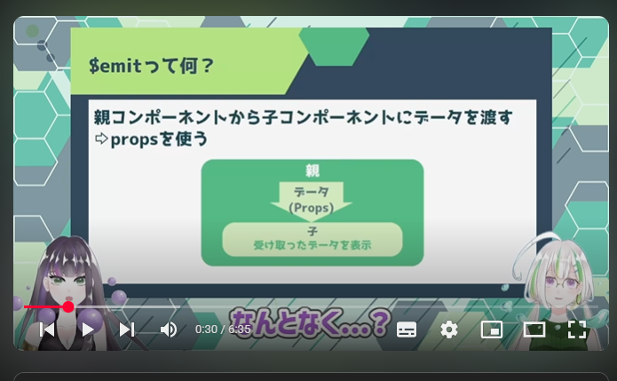
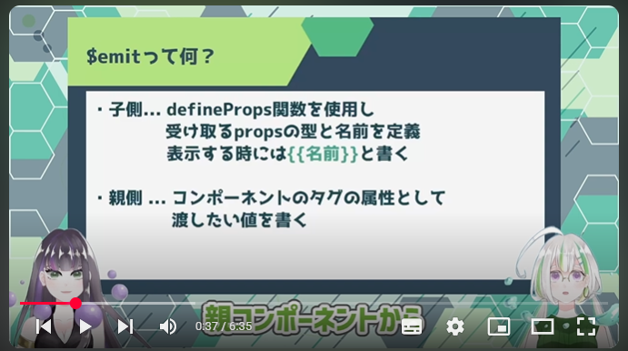
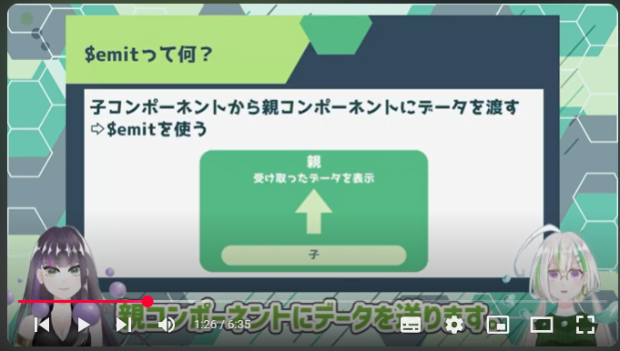
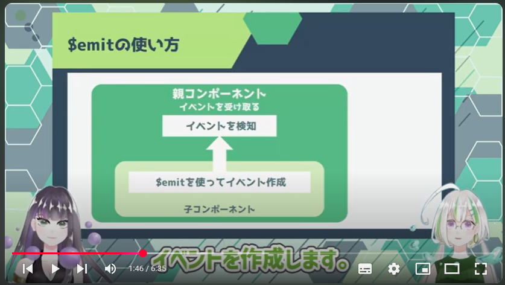
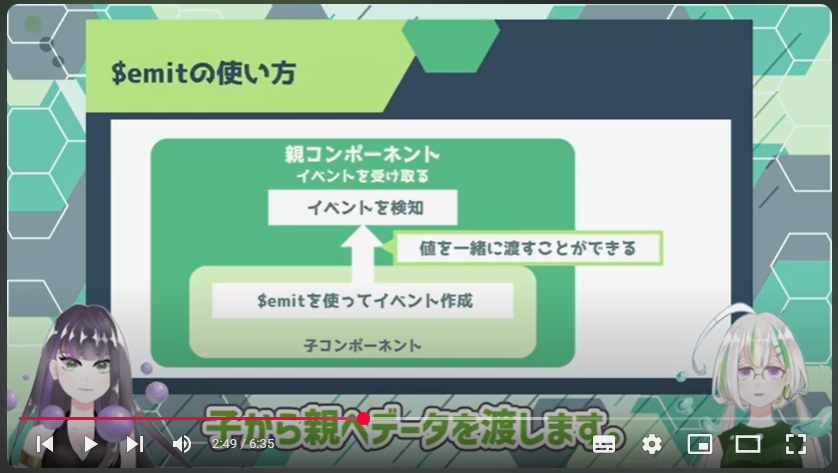

# Vue.js入門 Lesson7～10

～目次～

- <a href="#L7">Lesson7</a>
- <a href="#L8">Lesson8</a>

---
<a name="#L7"></a>
<br><br>

# 【Vue.js入門#7】Vue.jsでWebアプリケーションを作ろう！/$emit【Vue3】

https://www.youtube.com/watch?v=4VWRgmOcdB8&list=PL33OZZ24O4xDJ-_mqltklx8-9DK79iDOj&index=7


## $emitとは









---


## $emitの使い方







## 実際のコード

> [!WARNING]
> 
> バージョンの違い(vue@3.5.17)のためか、動画の通りではエラーになり、
> さらにESLintではセーフになってもイベントを拾ってくれない。
> 

child-componentの扱い方に違いがあった。

`<child-component>`ではなく、`<インスタンス化されたコンポーネント名 />`だった。

`<child-component>`にしたければ、

```javascript
　import child-component from ***.vue
　export default {
 　　components: {
	 　　　//呼び出す名前を定義
	 　　　child-component
	 　 }
	 }
```


（参考）
- Vue3 の Composition API で親コンポーネントから子コンポーネントのメソッドを呼び出す（逆も）

https://qiita.com/mml/items/2be6b8df94d932e9a047


- エラーについて　[Vue warn]:Property or method "name" is not defined on the instance but referenced during render.

https://qiita.com/katu_/items/9474ed207326f3a5d02c


- Vue.jsコンポーネント間の値の受け渡し

https://tech.adseed.co.jp/post103


●　子コンポーネント

```javascript
<template>
    <button @click="sendMessage">メッセージを送る</button>
</template>

<script>
    export default {
        methods: {
            sendMessage(){
                this.$emit('message', '子コンポーネントから送られたデータ');
            },
        },
    };

//this.$emit('親コンポーネントで受け取るときに使うイベント名', 実際に渡すデータ)
//            ↑ @messageのように使われる。                  ↑複数の引数に渡すこともできる
</script>

```


●　親コンポーネント

```javascript
<template>
  <Lesson7Component @message="handleMessage"></Lesson7Component>
  <p>{{ receivedMessage }}</p>
</template>

export default {
  name: 'App',
  components: {
    Lesson7Component,
  },
  data(){
    return {
      receivedMessage:"",
    };
  },
  methods: {
    handleMessage(message){
                  //↑ 子コンポーネントから受け取ったデータ
      this.receivedMessage = message;
    },
  },
}
</script>

```

--------------------
--------------------
--------------------

<br><br>

<a name="#L8"></a>
<br><br>

# 【Vue.js入門#8】Vue.jsでWebアプリケーションを作ろう！/ローカルストレージ【Vue3】

https://www.youtube.com/watch?v=9LoCJLIxB3U&list=PL33OZZ24O4xDJ-_mqltklx8-9DK79iDOj&index=9


## ローカルストレージとは

ブラウザ上でデータを保存する方法。

DBを使用することなく、データを操作できる。

ローカルストレージでは、`key`と`value`の組み合わせで、文字列を保存できる。

配列やオブジェクトを扱いには`JSONデータ`として文字列に変換する必要がある。


### データの操作

1. データを取得 - `getItem(key)`
1. データを保存 - `setItem(key, value)`
1. データを削除 - `removeItem(key)`

<br>

●　使用例

```javascript
localStorage.setItem('message','適当な文字列');
```

★　ローカルストレージの内容は、F12デベロッパーツールの、Applicationで確認できる。


